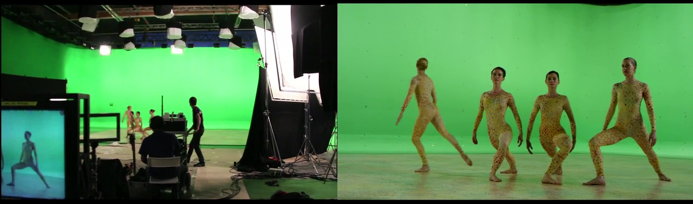
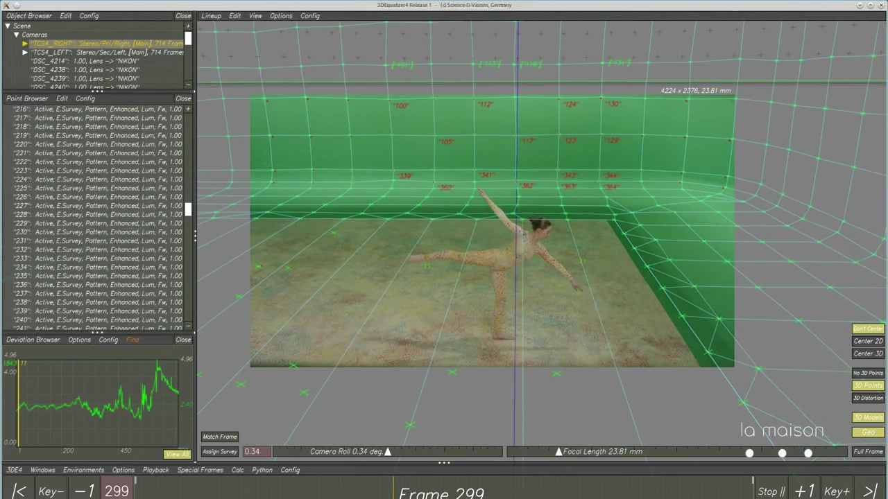
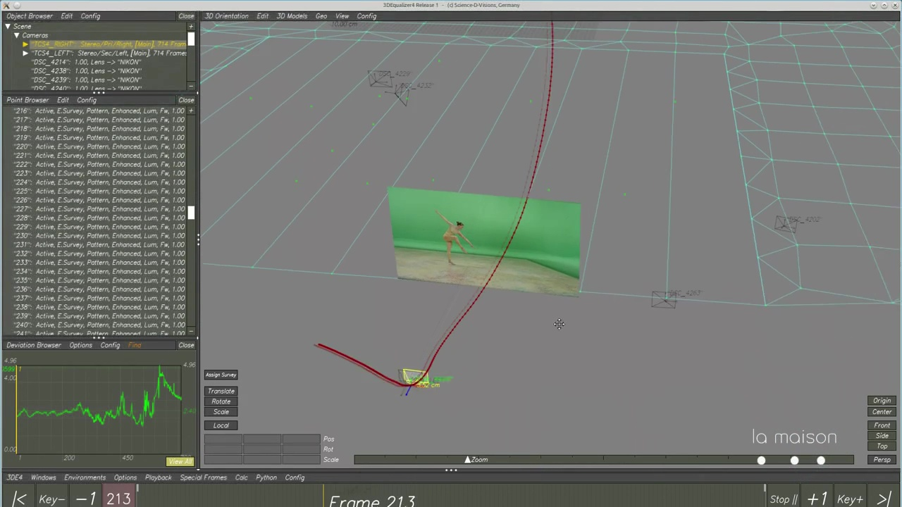
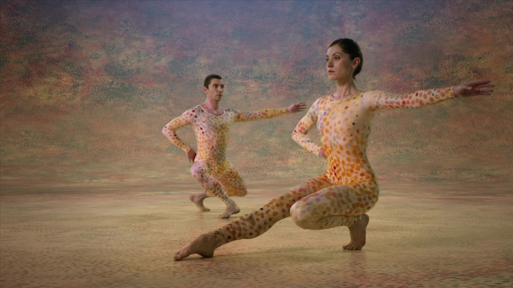

Tracking 3D de caméra :
=======================

   
   tournage du documentaire 'Merce'
   
Le processus de tracking de caméra consiste a recréer une caméra virtuelle identique a la caméra réelle utilisée pour filmer des plans dans un film.
Cette caméra virtuelle est alors utilisée dans des logiciels 3D ou 2D (compositing) pour assembler des éléments 3D dans les images tournées.

Ce processus implique d'analyser et de "tracker" des points particuliers de l'image au long de la séquence puis de recréer la trajectoire 3D dans l'espace sur la base des mouvements de ces points.

Elle implique aussi de calculer et réappliquer tous les paramètres de distorsion de la lentille de l'objectif sur les images créées.

Nous utilisons ces techniques depuis plusieurs années et avons développé de nombreux outils pour gérer le "workflow" sur nos productions.

   
   tracking de caméra dans 3DEqualizer
   
Tracking de caméras stéréo :
============================
   

   
   exemple de trajectoires stereo dans 3DEqualizer  
   
Dans le cas d'un tournage stéréo à 2 caméras de nouvelles problématiques apparaissent ;

-optimiser le travail pour réutiliser le tracking d'une caméra "master" (en général l'oeil droit) afin de régénérer de manière automatique ou semi-automatique le deuxième oeil

-sur la plupart des dispositifs une des caméras filme à travers un miroir (pour des raisons d'encombrement) ce qui entraine des deformations et abberations dont il faut tenir compte au moment du tracking

-toutes les opérations, comme la suppression/reapplication des distorsions doit se faire sur deux séquences en parallèle (oeil droit et gauche)

Développements effectués :
=========================

Dans le cadre du projet documentaire sur le choreographe américain Merce Cunnigham (Production : Arsam International, Réalisatrice : Alla Kogvan) dont les images illustrent ce document, nous avons modifie notre workflow afin d'y intégrer toutes les problématiques liées à la stéréo. Toutes les routines d'import/export dans les logiciels 2Ds et 3Ds (Flamme, Nuke, Houdini, Softimage XSI) ont été réécrites pour tenir compte de la spécificité de la stéréo.

   
Logiciels utilises : 
.....................

-3DEqualizer (www.sci-d-visions.com) , language de programmation python/Perl

-Houdini : (www.sidefx.com)

-Softimage XSI , Flame : (Autodesk)

-Nuke : (the Foundry)

