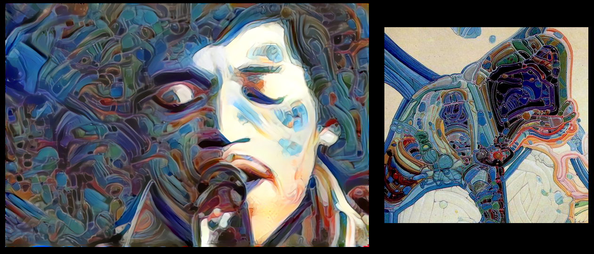
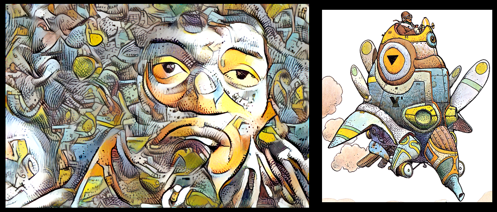

Application aux images animées et effets spéciaux
=================================================

Nous souhaitons investiguer ces techniques afin de les appliquer à des images animées dans le but de les proposer à nos clients dans le domaine de la publicité , du clip musical ou du long métrage. Elles ouvrent une perspective totalement nouvelle et originale dans l'offre d'effets visuels que nous souhaitons développer.

L'intelligence artificielle apparaît dans tous les domaines et particulièrement dans les métiers de l'image. Elle peut nous amener des gains de productivité mais aussi de créativité.

C'est le but de ces recherches.

   

   
Une performance de Jimi Hendrix 'repeinte' dans le style de Jean "Moebius" Giraud