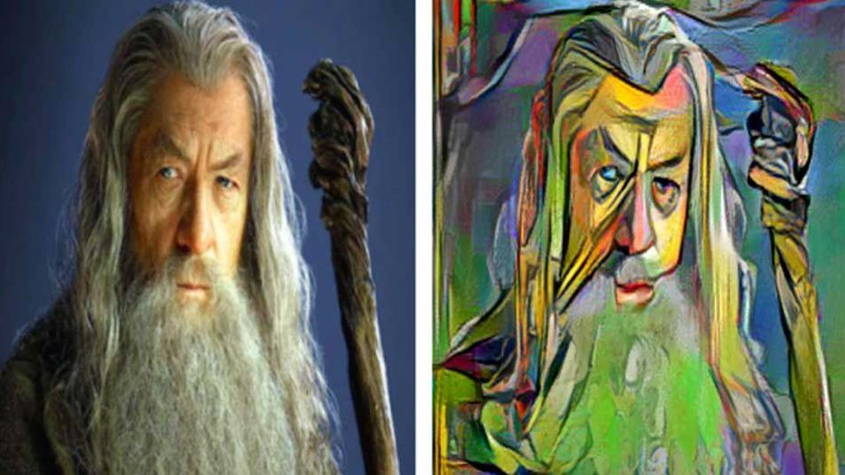
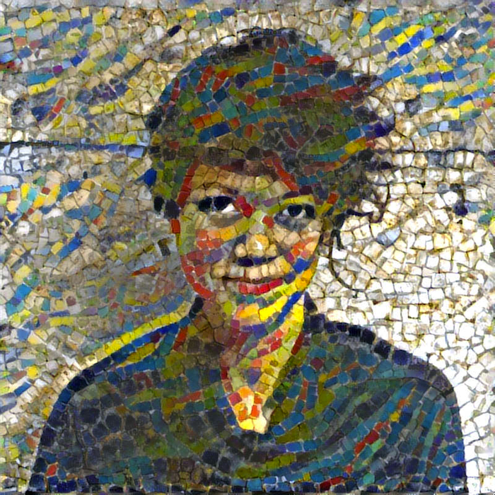
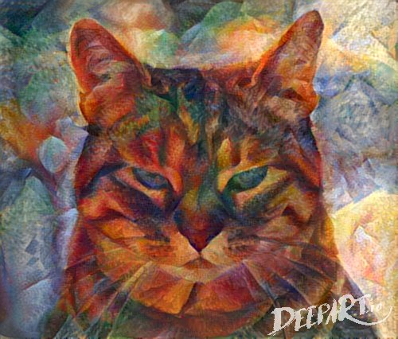

Deep Style
==========

Le 26 aout 2015 , une équipe de chercheurs de la chaire de reconnaissance d’images de l’Université de Freiburg a mis en ligne des exemples saisissants de transfert du style de Vincent Van Gogh, Picasso ou Edvard Munch. Chacun de ces grands maitres possède un style unique que l’oeil humain reconnaît presque immédiatement et sans difficulté. Le RNA utilisé par l’équipe allemande s’est entrainé sur les images des œuvres originales puis a transféré le style de l’artiste à de banales vidéos. Le résultat est impressionnant. On assiste ici à l’émergence d’une nouvelle capacité de transfert et de prolongation de l’œuvre d’un artiste sur d’autres supports.
 

   
A Neural Algorithm of Artistic Style
Leon A. Gatys, Alexander S. Ecker, Matthias Bethge

Reference : http://arxiv.org/pdf/1508.06576v2.pdf

Peu apres plusieures implémentations open-source ont ete proposées notament par Justin C johnson :

https://github.com/jcjohnson/neural-style

Ces implémentations utilisent Torch7 , une librairie créée et supportée par Google,Facebook,Twitter et toute une communauté scientifique specialisée dans l'utilisation des réseaux neuronaux et du deep learning.

   
