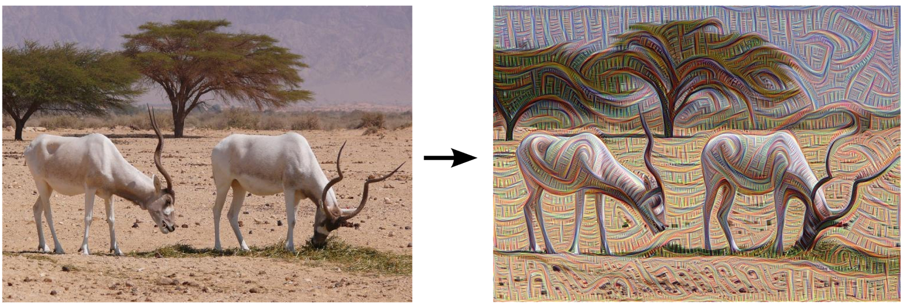
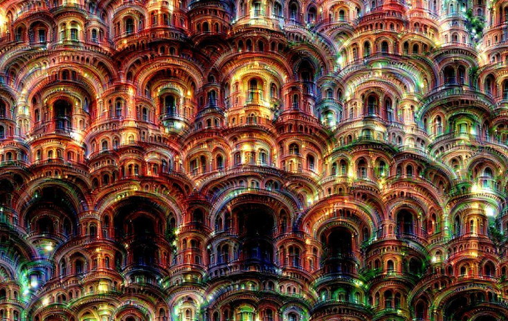

Introduction
============

   
Né dans les années 1940 sous la dénomination Réseaux de Neurones Artificiels (RNA), le 21ème siècle a offert une seconde jeunesse à ce mode de calcul grâce aux développements recents et a l'avancée exponentielle des technologies des cartes graphiques , notament les produits de la societe NVIDIA.

Les technologies d’apprentissage profond (deep learning) s’appuyant sur les réseaux de neurones artificiels (RNA) multiplient les performances technologiques notamment dans le domaine très porteur de la reconnaissance d’objets, de formes et d’images.

Recement un nouveau mouvement artistique emerge.
Son nom: l'inceptionisme.
Son créateur Google, ou plutôt ses ingénieurs qui travaillent sur une intelligence artificielle de reconnaissance d'images.
Le mouvement a débuté avec un billet de blog, publié le 17 juin 2015 par une équipe d'ingénieurs logiciel de Google

Leur but était, au départ, d'obtenir un système de reconnaissance d'images qui puisse, par, exemple, identifier un chien comme tel.
Mais l'équipe de Google confiait avoir voulu aller plus loin, et avoir demandé à son réseau neuronal d'accentuer un peu plus encore son niveau de reconnaissance.

Dans sa publication de fin juin, Google a publié des images « traitées » par Deep Dream (c’est le nom de l’intelligence artificielle) et face à l’engouement inattendu pour les résultats, Google a mis en ligne un code permettant de créer des images inspirées du système neuronal.

'Deep Dream' est un outil qui peut être utilisé, au même titre qu’un pinceau pour « créer de l’art ». Nouvelle forme artistique créée par Google, l'inceptionisme apparaît comme une forme farfelue d'art contemporain.

