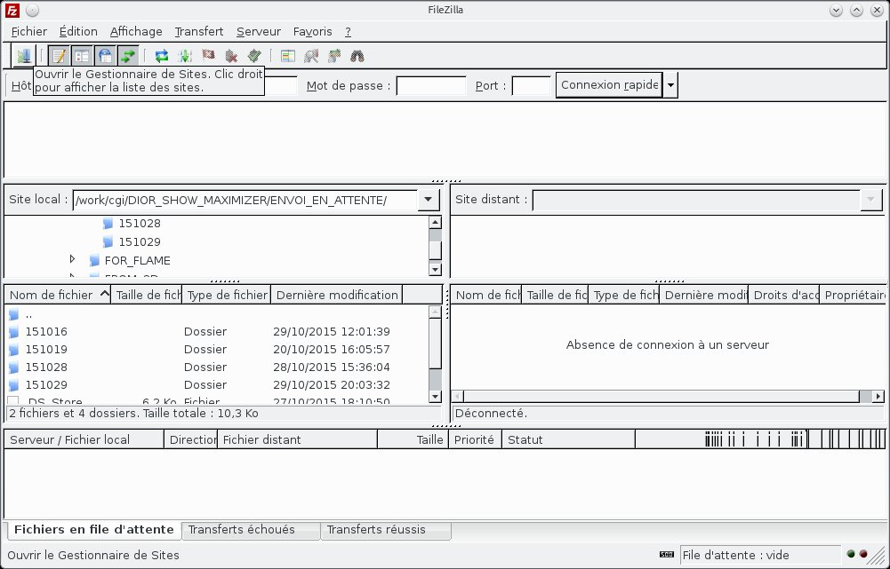
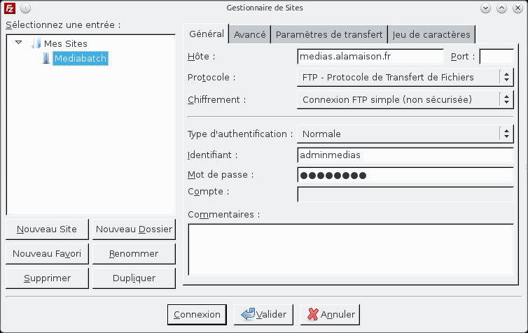
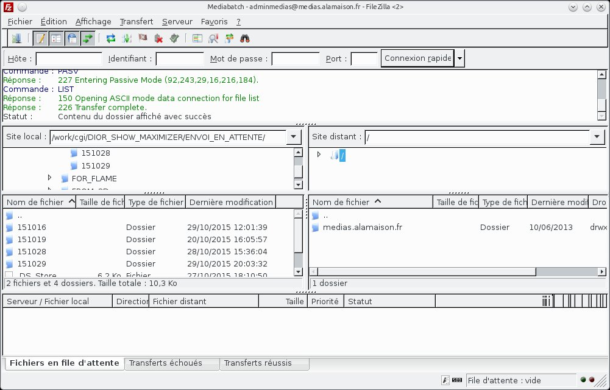
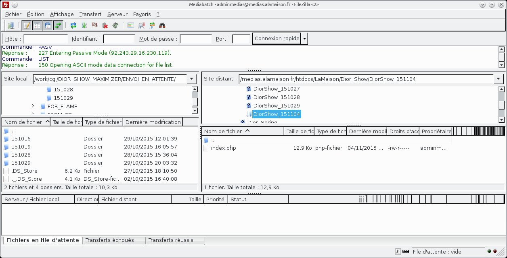
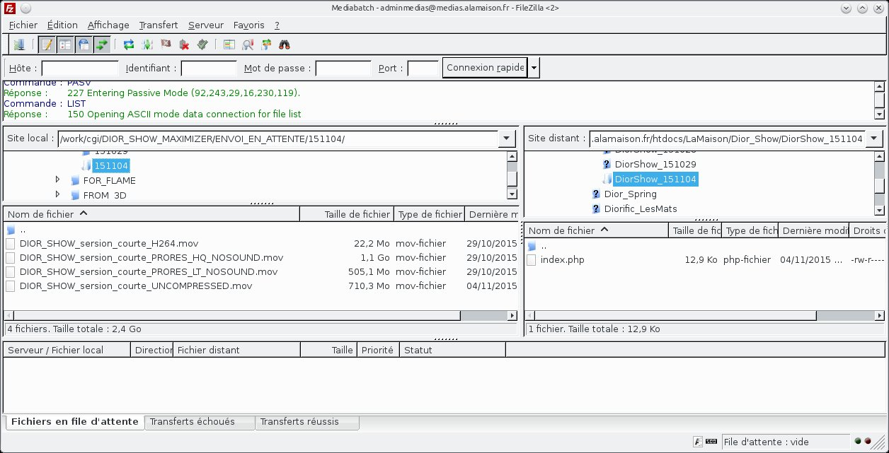
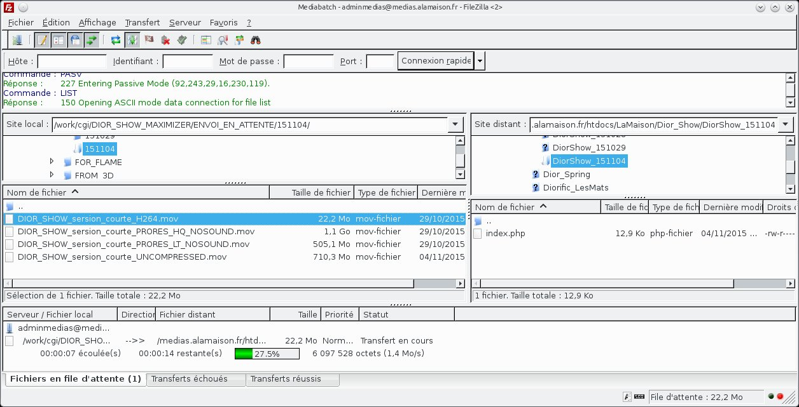
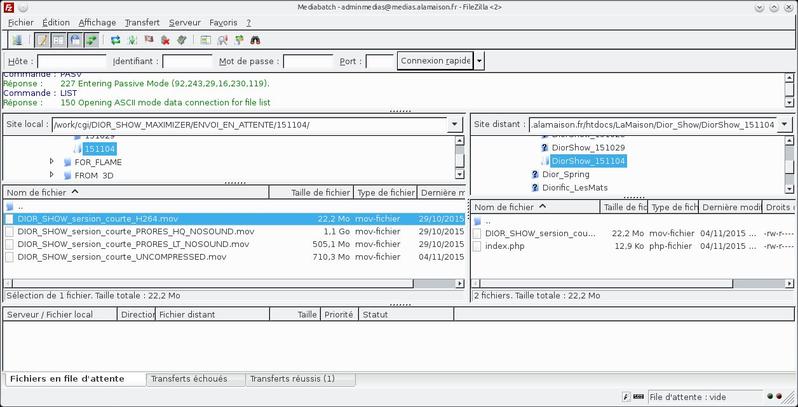
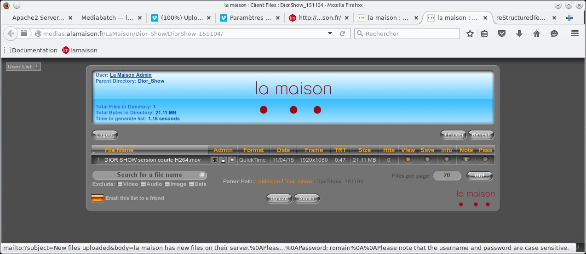
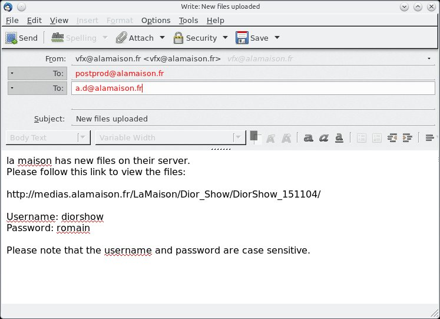
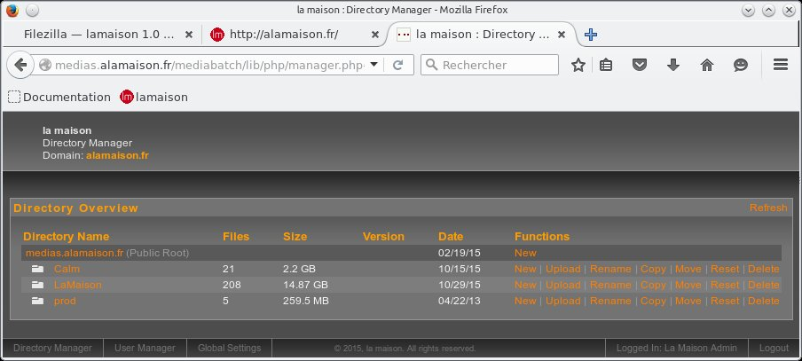

Filezilla
=========

https://filezilla-project.org/

   
Gestionnaire de sites
.....................

pour se connecter au serveur ftp distant : ouvrir le gestionnaire de sites (en haut a gauche)

   
Mediabatch
..........

clicker sur Connexion

   
connexion au serveur
....................

filezilla se connecte a notre serveur ftp.dans la fenètre "Site distant" s'affiche la racine de notre site : medias.alamaison.fr

   
navigation dans le site distant
...............................

dans la fenètre "Site distant" naviguer jusqu'au dossier créé precédement.

.. code:: csh

  medias.alamaison.fr/htdocs/LaMaison/....
  medias.alamaison.fr/htdocs/Calm/....
  

   
navigation dans les dossiers locaux
...................................

dans la fenètre "Site local" naviguer jusqu'au dossier contenant les fichiers a transférer.

.. code:: csh

  /work/cgi/PROJET/ENVOI_EN_ATTENTE/datedujour
  

   
transfert des fichiers
......................

glisser/déposer les fichiers a transférer depuis le site local (work) vers le site distant.La fenètre "Fichiers en file d'attente" vous indique l'état du transfert.
  

   
fin des transferts
..................

a la fin du transfert les fichiers doivent apparaitre dans l'explorateur de fichier du site distant.l'onglet "Transfert réussis" et "Transferts echoués" vous indiqueront d'éventuels problèmes de transfert.
  

   
Retour dans Mediabatch
......................

   
de retour dans Mediabatch , rafraichir la fenètre.vos fichiers doivent apparaitre.clicker sur "Email this list to a friend" pour envoyer le mail au chargé de production ou a Annie directement si il n'y a pas de chargé de production a ce moment la.Ils se chargeront de prévenir les clients.N'envoyer ce mail que quand les transferts sont réussis et vérifiés . Si les transferts sont trés longs donnez une estimation du temps de transfert.
  

Nota
....

on peut aussi faire des transferts dans l'autre sens (download) depuis notre site ftp ou un site ftp client en glissant/déposant des fichiers depuis le site distant vers le site local (work ou échange)

Problèmes fréquents
...................

l'experience nous a appris qu'il y a quelques erreurs fréquentes :

*	noms de sous dossiers identiques dans des projets différents : toujours ajouter le nom du projet avant la datedujour , sinon les mots de passe ne sont plus correctement gérés.

**mauvais**

.. code:: csh
   
  -DIOR
    -151022
  -INSONDABLES
    -151022
    
**correct**

.. code:: csh
   
  -DIOR
    -Dior_151022
  -INSONDABLES
    -Insondables_151022
    
*	dossiers n'ayant pas de fichiers "index.php" présents , en général créés ailleurs que dans l'interface de Mediabatch.Les dossiers n'apparaisent pas dans Mediabatch si ce fichier manque.

*	site distant plein : notre site distant a une taille limitée (30Gigas).Si le site est plein , les transferts sont interompus et corrompus.il faut alors faire le ménage dans le Directory Manager ou dans Filezilla.On peut connaitre la taille totale occupée en repliant tous les dossiers dans le FileManager de Mediabatch et en additionant les sizes des dossiers racines (ici Calm , LaMaison , prod).

