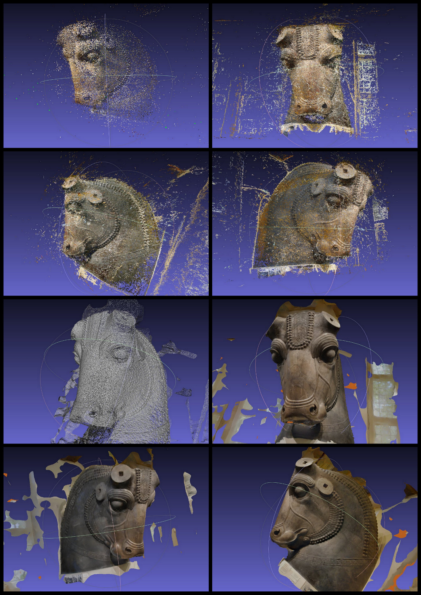

Autres exemples
===============

Colossal Bull Head from Persepolis - Musée oriental de Chicago.(fig. 15)

Ces têtes colossales servaient de protecteur aux bâtiments importants.

   
   Colossal Bull Head from Persepolis - Musée oriental de Chicago
   
   reconstruction a partir de 73 photos collectées sur Internet