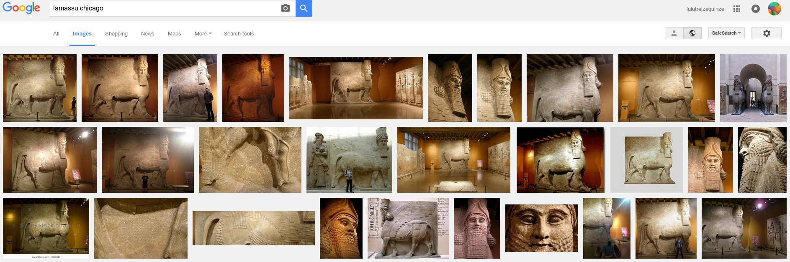

Collecte de photos sur Internet
===============================

   
Internet permet d’accéder a une masse gigantesque d'images.Afin de pouvoir downloader une collection conséquente d'images nous avons besoin d’accéder a ces recherches par une interface de commandes (cli).

Il existe essentiellement 2 sources de photos accessibles par mot-clef:

**Google Images**
.................

   
   exemple de recherche Google image
   
   ici un Lamassu Assyrien exposé au musée Oriental de Chicago
   
Google ne propose plus de cli pour downloader automatiquement une sélection d'images par mot clef. Neanmoins en downloadant le contenu html du résultat d'une recherche et en le filtrant on peut récupérer les URL's des images.Nous avons écrit un script en langage Perl permettant de faire cela.Malheureusement Google limite les résultats des recherches a 100 images.Ce qui limite un petit peu les résultats.

**Flickr Images**
.................

Flickr (Yahoo) propose une API accessible dans différents langages de programmation.Nous avons choisi le module Perl Flickr::API qui permet d'automatiser la recherche et le téléchargement d'images sur le site de Flickr. Un des grands avantages de Flickr est de donner accès aux images originales des appareils photos et donc a leur informations (MetaData) EXIF.

En effet pour la plupart des algorithmes de StructureFromMotion ces données sont indispensables pour initialiser le processus incrémental de reconstruction des positions de cameras.

La majorité de nos images proviendront donc de Flickr.

.. figure:: images/mysnap4.jpg
   :scale: 100 %
   :align: center
   
   exemple de recherche Flickr image
   
   Flickr retourne 222 images pour cette recherche
   
**traitement des données EXIFs**
................................

Les informations contenues dans les données EXIF nous servent a retrouver deux informations fondamentales pour initialiser les valeurs intrinsèques des cameras : la focale et la taille du capteur CMOS ou CCD utilise lors de la prise de vue.La focale est en général inscrite explicitement dans les données EXIFs. Par contre pour retrouver la taille du capteur il est nécessaire d’accéder a deux informations EXIFs : le Modèle et le Type de l'appareil photo.Ces deux paramètres sont en général fourni dans les EXIFs.

.. figure:: images/mysnap78.jpg
   :scale: 100 %
   :align: center
   
   exemple de donnes Exif accessibles
   
   image prise par un appareil Canon Powershot SX200 / focale de 5 mm
   
Pour manipuler les EXIFs de manière automatique nous utilisons le module Perl Image::ExifTool ainsi que la librairie Imagick et son module Perl Image::Magick pour un accès plus général aux opérations sur des images en ligne de commandes.

Grace a ces outils nous avons mis au point une suite de scripts permettant de classifier les images par données Exifs , taille de capteur , résolution etc .. de manière automatique.

**Taille des capteurs CMOS**
............................

Pour récupérer les informations de taille de capteur CMOS nous avons construit une base de données contenant plusieurs milliers de références d'appareils photos.Cette base de données est remise a jour si besoin a partir d'internet et notamment du site DPreview.com qui constitue la référence en la matière.

.. figure:: images/mysnap80.jpg
   :scale: 80 %
   :align: center
   
   exemple d'informations retournées par le site DPreview.com
   
   la taille du capteur est de 22.4 mm par 15 mm
   
   